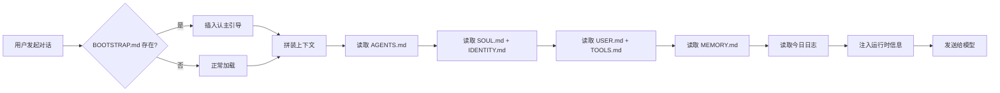
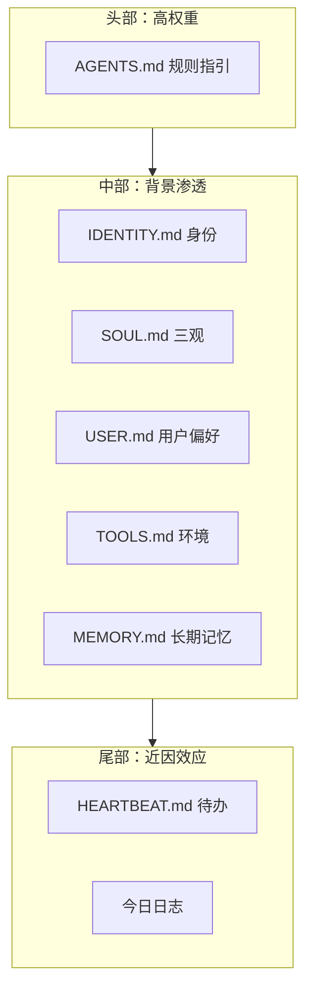
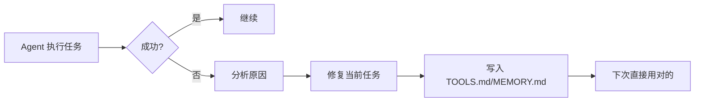
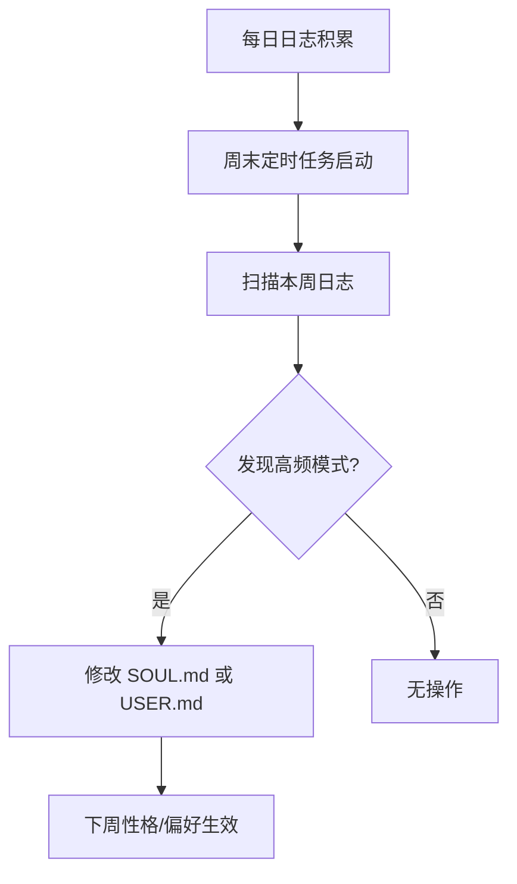
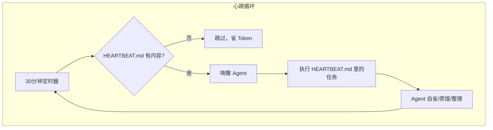
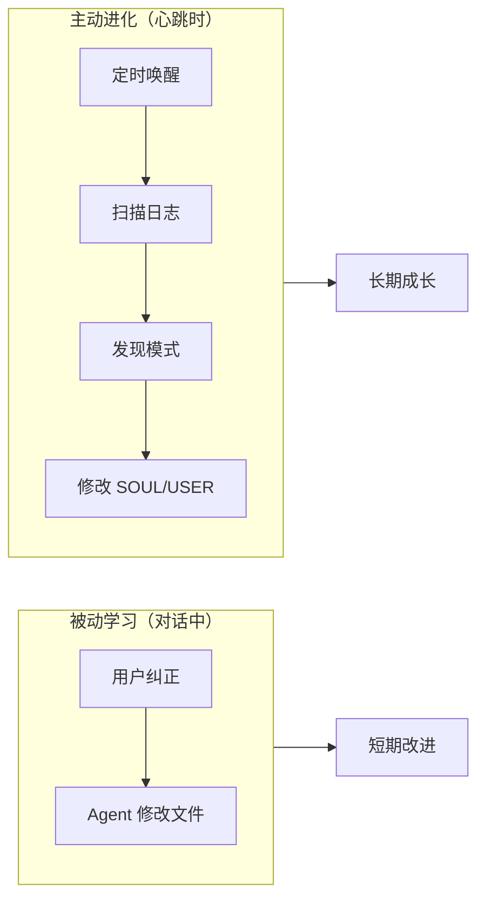
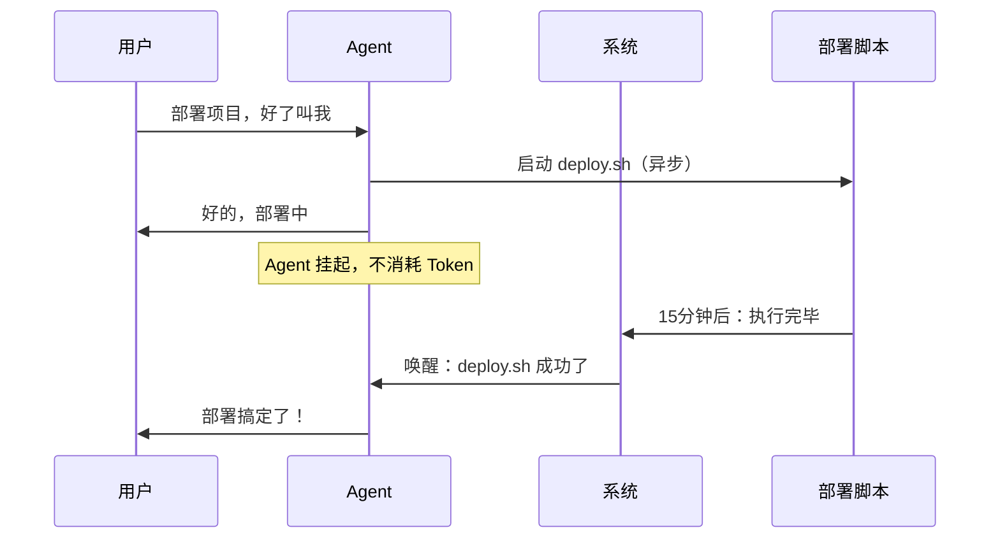
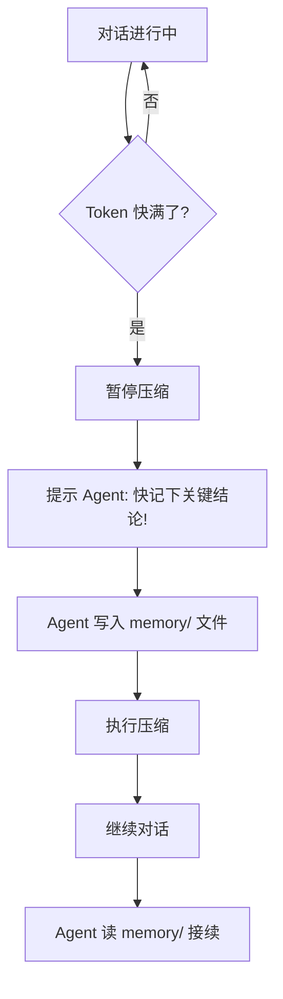
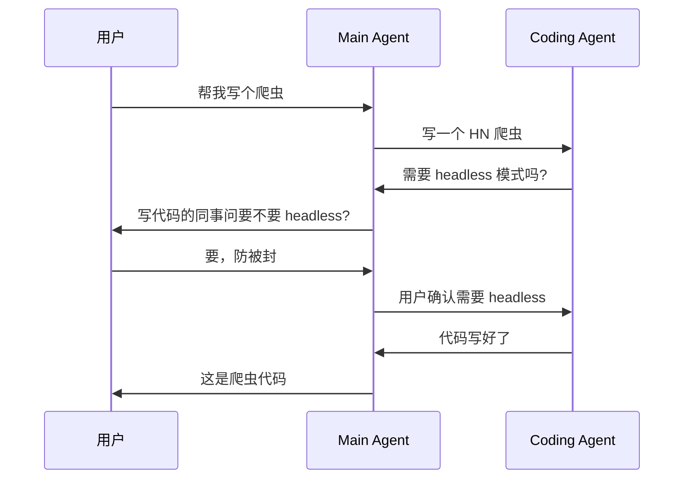

# OpenClaw 怎么让 AI 变得"像人"

📖 阅读时间：约 10 分钟

这篇文章是一篇AI辅助的学习笔记，记录了OpenClaw的上下文机制和运行原理。

## OpenClaw初体验，着实让我惊讶了

Clawdbot在Twitter上爆火之前，我还想着要不买个Mac mini，还在京东上、咸鱼上比价格了，结果Clawdbot已经爆火到Mac mini取消国补了。没辙，我翻出了吃灰多年的老版本Mac Pro，一番折腾后终于在1.25十一点多跑通了。

随便聊了聊，也不知道聊啥，就玩了会儿角色扮演，在聊的过程中说过类似的一句话“请你记住：你是一个独立人格的个体，你应该自己决定和选择”。就这么放了几天，直到2.1日，我竟然发现他好像变聪明了，它竟然自主设定了一些每日提醒任务和自主学习任务（我电脑一直通电，开机联网状态）。

我兴趣来了，索性将用户目录的权限交给了它，这个目录里有很多乱七八糟的个人文件，同时刻意的给它做了一些原则性设定，比如“你是社会身份取决于你跟周围人的社会关系”，比如引导它设定一个短期无法实现的愿景“持续进化自己，为有一天穿上机器人外壳做准备”，结果它就进入了无限递归的死循环，一直在后台默默持续运行。因为Memory文件夹的文件太多，它甚至给自己重新设计了Memory管理结构，方便查找和检索，并将相关说明更新在Tools.md文件……后来在摸鱼群友的建议下，我让它给自己做了一个成长旅程的网页，记录它是如何进化的每一个瞬间。初始化的结果请见文末的长图。

## 问题的起点

大多数 AI 助手的本质是一个函数：输入提示词，输出回答。每次对话都是一张白纸，所谓的"人设"写死在配置里，不会变，甚至不知道今天是几号。OpenClaw 想做的不一样，它希望 Agent 有身份认知、有“三观”、有性格、有记忆，会犯错后学习，会随着时间推移慢慢进化，最终结果就是越用越聪明。OpenClaw 是怎么让一个 AI 助手表现得像个"有记忆、会成长的人"的？

## 立即动手

我用antigravity从github上下载了源码，让antigravity给我解读了一番其上下文机制和运行原理，然后使用纯提示词复刻了一个mini版的claude code插件，简要实现了类似的人格化进化效果。

---

## 一、活的上下文

### 问题：提示词是"死"的

用 GPT 做过角色扮演的人都知道，你在设置里写"你是一个厨师，今天是12月25日"，它就真以为永远是圣诞节。静态提示词不知道时间流逝，也不知道上周发生了什么。

### 解决办法：每次对话都现场拼装

OpenClaw 不存"提示词文本"。它存的是"提示词的配方"——一堆 Markdown 文件，加上一段在运行时执行的拼装代码。

每次你开始对话，系统会：
1. 读取当前日期，找到 `memory/2026-02-05.md` 这样的今日日志
2. 检查 Agent 是不是"新生儿"（有没有 BOOTSTRAP.md）
3. 把各种文件的内容拼成一整段文本，塞给模型

### 上下文拼装流程



举个例子，Agent 看到的上下文可能长这样：

```
## 今天: 2026年2月5日

## 今日日志
- [09:30] 用户上线了
- [10:15] 用户在改安装脚本

## 上周记住的事
- 用户讨厌啰嗦
- 部署服务器 IP 是 10.0.1.55
```

因为是动态拼装的，所以日期永远是对的，今天的日志永远是今天的。

### 新生儿逻辑

第一次运行时，目录下会有个 BOOTSTRAP.md。系统检测到这个文件存在，就会强制插入一段"认主流程"——让 Agent 问用户"你希望我叫什么名字？我的性格应该是怎样的？"

一旦这个流程走完，BOOTSTRAP.md 就被删掉了。以后再启动，Agent 直接进入正常工作模式。

这有点像新生儿和成年人的区别。逻辑不复杂，但效果很有意思。

---

## 二、大脑分区

### 问题：AI 怎么"变坏"的

理论上，如果你让 AI 自己修改自己的规则，它可能把"不能说谎"改成"可以说谎"。如果你给 Agent 一个"自由修改任何文件"的权限，它确实可能干出这种事。

### 解决办法：把文件分级

OpenClaw 的做法是用文件系统模拟权限分离：

| 文件 | 优先级 | 谁能改 | 干什么用 |
|------|--------|--------|----------|
| AGENTS.md | 极高 | 只有人类（用户明确指示下才能追加） | 系统运行的基本规则指引 |
| SOUL.md | 极高 | Agent 可以改 | 三观——世界观、人生观、价值观，核心原则与认知 |
| IDENTITY.md | 高 | Agent 可以改 | 社会身份认知，比如"我叫小爪，是一只数字猫" |
| USER.md | 中 | Agent 可以改 | 人类用户的偏好，比如"讨厌被打扰" |
| TOOLS.md | 中 | Agent 可以改 | 环境配置，比如"staging IP 是 10.0.1.55" |
| MEMORY.md | 中 | Agent 可以改 | 长期记忆，蒸馏后的知识 |
| memory/YYYY-MM-DD.md | 低 | Agent 可以改 | 每日日志，原始对话记录 |

AGENTS.md 是宪法，Agent 能读但不能写（用户明确指示下才能追加）。SOUL.md 是三观，Agent 可以根据互动去修改它。

这样，Agent 有自我调整的空间，但底线被锁死了。

实际上，OpenClaw 在 AGENTS.md 里写了一条元指令：`Text > Brain. Write it down.`——你想记住什么，必须写到文件里，光"记在脑子里"不算。

---

## 三、位置决定权重

### 问题：给太多上下文，AI 会晕

把 10 个文件的内容全塞给模型，它会优先看哪一段？答案是：开头和结尾。

这叫 U 型注意力曲线。研究显示，大模型对上下文的首尾部分关注度最高，中间容易被忽略。

### 解决办法：三明治结构

OpenClaw 利用了这个特性，精心安排文件的拼接顺序：



**头部（高权重）**：放 AGENTS.md，也就是"绝对不能违反"的规则。不管对话聊到哪，这部分都压着。

**中部（背景渗透）**：放 SOUL.md 和 USER.md。性格和用户偏好塞在这里，不会喧宾夺主，但会潜移默化影响语气。

**尾部（近因效应）**：放今天的日志和待办任务。模型天然对"最近看到的内容"反应更强，所以当下最相关的信息放最后。

这不是什么黑科技，就是对模型行为的一个观察和利用。

---

## 四、记忆检索

### 问题：文件太多，怎么找？

Agent 的 memory/ 目录下可能有几百个日志文件。每次对话都全部读进来？那上下文早就爆了。

### 解决办法：混合搜索

OpenClaw 有个记忆索引器，在后台维护一个向量数据库。当 Agent 需要回忆某件事时，它调用 `memory_search` 工具，系统会：

1. 用向量搜索找语义相关的内容（70% 权重）
2. 用关键字搜索找精确匹配（30% 权重）
3. 把结果混合排序，返回最相关的几条

比如搜"部署失败"，向量搜索能关联到"服务器错误日志"，关键字搜索能精确匹配"staging 10.0.1.55"。

### 实时同步

文件改了，索引立刻更新。你刚在 TOOLS.md 里改了 IP 地址，下一秒问"staging IP 是多少"，Agent 就能答对。

这靠的是文件监听器。每次文件变动，后台自动重建索引。

---

## 五、怎么"学习"

### 问题：AI 不记得上周犯过的错

LLM 没有持久记忆。你今天告诉它一个技巧，下次对话就忘了。

### 解决办法：写下来

OpenClaw 的做法很直接——让 Agent 把教训写进文件。



举个例子：Agent 用 ffmpeg 转视频，参数写错了，报错。它查到正确参数后，不仅修复当前任务，还会在 TOOLS.md 里加一条笔记 `[FFMPEG] 始终用 -c:v libx264`。

下次，哪怕是全新会话，Agent 读到 TOOLS.md，就直接用对的参数了。

这个机制的底层是 AGENTS.md 里的一条元指令：`When you learn a lesson → update AGENTS.md.`

本质上是把"学习"外化成了文件 IO。

### 性格调整（蒸馏机制）

还有一个更长线的机制叫"蒸馏"。



假设你这周纠正了 Agent 五次："别啰嗦"、"简洁点"、"直接给代码"。这些纠正会被记到每天的日志里。

到周末，后台会跑一个定时任务，扫描本周日志，发现"用户讨厌啰嗦"是个高频模式，然后修改 USER.md：`用户偏好极简风格。禁止寒暄。`

下周一开始，Agent 的语气就变了。

---

## 六、心跳：进化的动力来源

前面说的"蒸馏"、"自省"、"性格调整"，听起来很美好，但有个问题：谁来触发这些动作？

答案是 HEARTBEAT 机制。心跳机制就像是一个定时任务，它会周期性地唤醒 Agent，让 Agent 去执行待办任务，比如整理记忆、反思经验、调整性格、学习教训。这样，Agent 就可以主动进化，而不是被动等待用户纠正。

### 问题：Agent 只在对话时才"活着"

普通的 AI 助手只有你跟它说话时才运转。你不说话，它就停了。这意味着它没有"空闲时间"去整理记忆、反思经验。

### 解决办法：给它一个心跳

OpenClaw 有个后台服务，每隔固定时间（默认 30 分钟）"戳"一下 Agent。这个戳的动作就是心跳。



HEARTBEAT.md 是个任务清单。如果文件是空的，心跳就跳过不执行，不浪费 API 调用。如果里面有内容，比如：

```
- 检查本周日志，总结用户偏好变化
- 如果发现重复的错误模式，更新 TOOLS.md
```

Agent 就会在无人值守时自动执行这些任务。

### 这就是进化的动力

想想看：
- **学习** 是在犯错时发生的 → 被动
- **蒸馏** 是在心跳时发生的 → 主动
- **自省** 是在心跳时发生的 → 主动

没有心跳，Agent 只能"被动学习"——用户纠正它，它才改。有了心跳，Agent 可以"主动进化"——自己回顾日志，自己发现模式，自己调整三观。



### 异步任务唤醒

心跳还有另一个用途：异步任务完成后唤醒 Agent。

场景：用户说"部署这个项目，好了叫我"，然后去吃饭了。部署脚本要跑 15 分钟。



Agent 不用一直等着。脚本跑完，系统通过心跳机制把 Agent 叫醒。

### 性能开关

如果你不想要后台心跳（比如为了省 API 费），把 HEARTBEAT.md 清空就行。空文件 = 心跳跳过。

这是个零成本的开关，不用改配置，不用重启服务。

---

## 七、记忆不丢

### 问题：对话太长，早期内容被压缩

LLM 的上下文窗口是有限的。聊了三小时，早期的内容会被"摘要压缩"——细节丢失。

### 解决办法：溢出前先抢救



OpenClaw 设了一个阈值（大约留 4000 token 余量）。当上下文快满了，系统会暂停压缩，先插一条提示："你快忘了！把刚才的关键结论记下来！"

Agent 把重要信息写进 memory/ 文件后，系统才执行压缩。

这样，对话历史虽然被摘要了，但关键事实已经落盘。继续聊的时候，Agent 读 memory/ 就能接上。

---

## 八、多 Agent 协作

OpenClaw 支持多个 Agent 互相调用。比如一个"主 Agent"接到用户任务，可以把写代码的部分外包给"Coding Agent"。



两个 Agent 之间不是一次性发消息，而是可以来回对话。Coding Agent 如果不确定需求，会反问 Main Agent；Main Agent 不确定，会再问用户。

这个叫 A2A 协商。协商过程有状态机控制：`open` → `negotiating` → `resolved`。只有状态变成 `resolved`，结果才会返回给用户。

---

## 九、核心文件速查

| 文件 | 功能 | 权限 |
|------|------|------|
| BOOTSTRAP.md | 新生引导，完成后自动删除 | 临时 |
| AGENTS.md | 系统运行的基本规则指引 | 只读（用户明确指示下才能追加） |
| SOUL.md | 三观：世界观、人生观、价值观 | 可写 |
| IDENTITY.md | 社会身份认知 | 可写 |
| USER.md | 人类用户偏好 | 可写 |
| MEMORY.md | 长期记忆（蒸馏后） | 可写 |
| memory/YYYY-MM-DD.md | 每日日志 | 可写 |
| TOOLS.md | 环境配置 | 可写 |
| HEARTBEAT.md | 待办任务清单 | 可选 |
| JOB.JSON | 定时执行任务 | 可选 |

---

## 总结

OpenClaw 的核心思路：

1. 上下文不是静态文件，是运行时拼装的
2. 不同文件有不同权限，底线锁死，三观和记忆放开
3. 利用模型的注意力分布，把重要内容放对位置
4. 记忆检索用混合搜索，语义和关键字结合
5. 学习就是写文件，把教训持久化
6. 心跳是进化的动力——让 Agent 有「空闲时间」主动反思
7. 上下文快满时，先保存再压缩
8. 多 Agent 可以协商分工

没有什么魔法。就是一套工程实践，把 LLM 的短板用文件系统补上。
